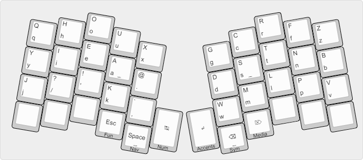
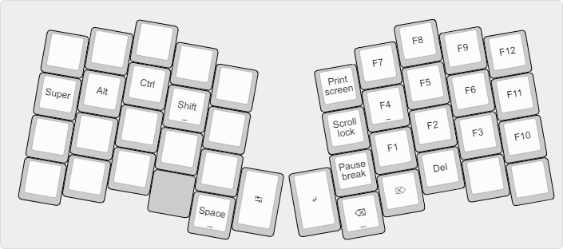
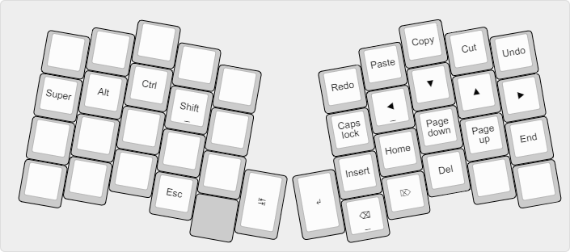
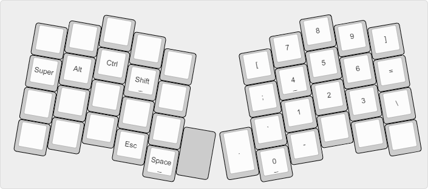
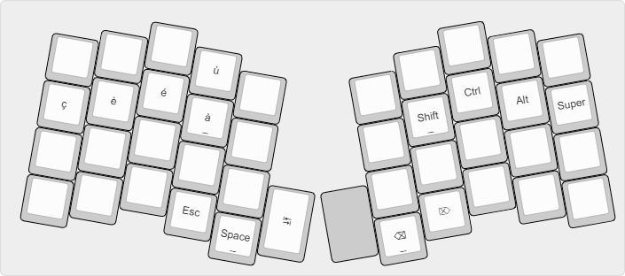
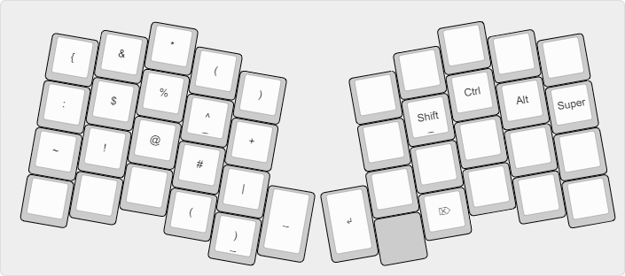
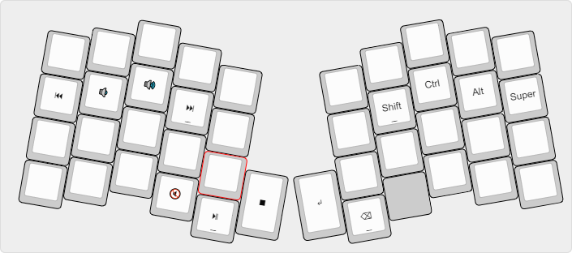

# Miryoku + Bealk for Atreus keyboard

This is a fork of [Miryoku](https://github.com/manna-harbour/miryoku/) layout with base layer from [Bealk 15](https://deskthority.net/wiki/BEAKL#BEAKL_15) using Atreus from Keyboardio.

## Layout

### Variant Principles

- `Num` & `Fun` layers switched to left hand (numpad usage habit).
- `Mouse` layer replaced by `Accents` layer (helpfull for french).

### Layers

#### Base

#### Functions

#### Navigation

#### Numerics

#### Accents

#### Symbols

#### Medias

